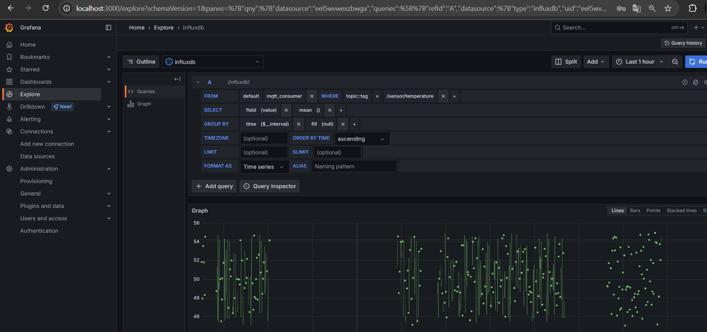
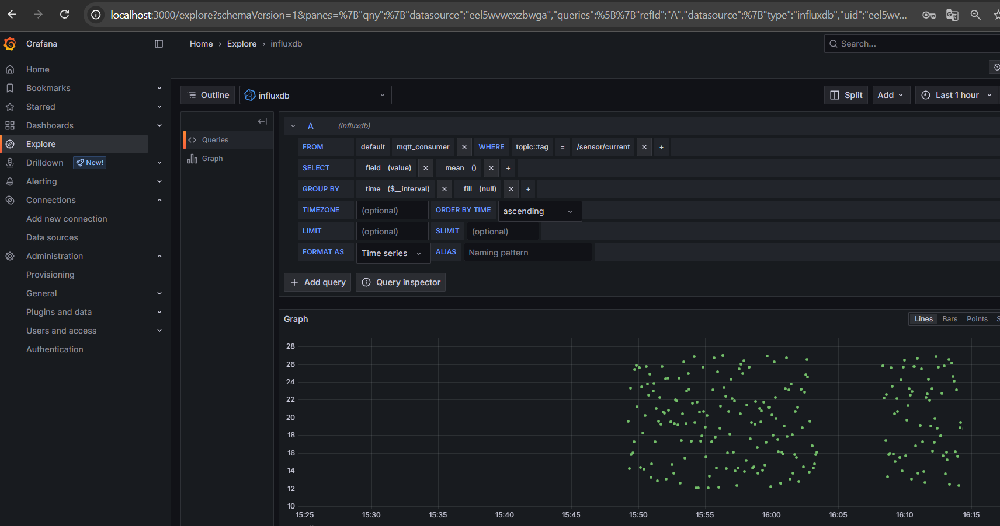

# Отчёт по практике "Docker IoT"

## Постановка задачи
Развернуть систему сбора данных от датчиков через MQTT-брокер, сохранить в базу временных рядов InfluxDB и визуализировать в Grafana.

## Реализация

### Структура проекта
```
- assets/
  - images/
- vms/
  - client/
    - simulator/
      - main.py
      - Dockerfile
  - gateway/
    - mosquitto/
      - mosquitto.conf
  - server/
    - grafana/
    - influxdb/
    - telegraf/
      - telegraf.conf
    - docker-compose.yml
- report.md
```

### Компоненты:
- **Simulators**: 6 контейнеров, публикующих данные в MQTT брокер
- **Gateway**: Mosquitto брокер в контейнере
- **Server**: InfluxDB, Telegraf, Grafana в docker-compose

### Датчики:
- Температура (TemperatureSensor)
- Давление (PressureSensor)
- Ток (CurrentSensor)
- Вибрация (VibrationSensor)

### Особенности:
- Сохранение данных через MQTT в InfluxDB
- Графическое отображение данных в реальном времени в Grafana
- Все контейнеры связаны через виртуальную сеть docker-compose

### Скриншоты



## Инструкция по запуску
1. Клонировать репозиторий
2. Перейти в папку `vms/server`
3. Выполнить команды:
```
docker-compose up --build
```
4. Зайти в браузере на `http://localhost:3000`
5. Настроить источник данных InfluxDB
6. Создать дашборды для отображения данных

